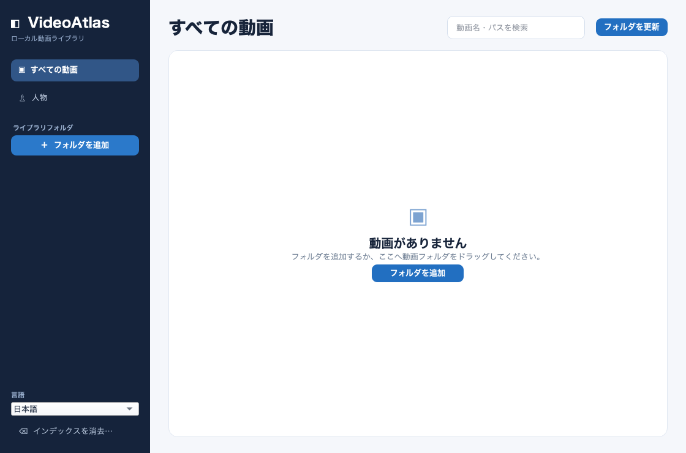
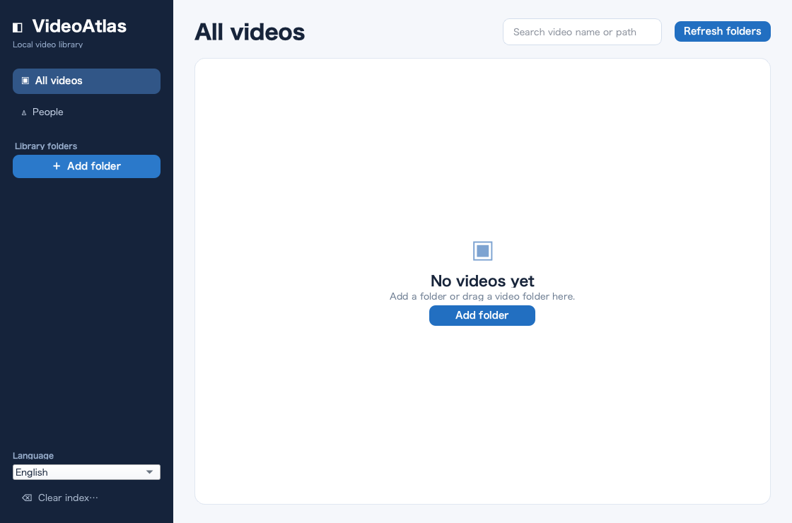

# VideoAtlas

[日本語](README.md) | English

VideoAtlas is a local video library app for macOS. It lists and plays videos from selected folders, then uses detected faces to help find candidate people, related videos, and appearance times. The current app is implemented in Python and PySide6.

## Features

- Add video folders and list MP4, MOV, and M4V files recursively
- Play videos and seek to face detection timestamps
- Filter related videos and timestamps by selecting a candidate person's face image
- Manually assign faces, split or merge candidate groups, unclassify faces, and exclude faces
- Pause and resume analysis, with results stored in SQLite

Faces the automatic grouping cannot confidently assign remain unclassified and can be corrected manually. A candidate group is based on model similarity; it is not identity verification or biometric authentication.

| Japanese UI | English UI |
| --- | --- |
|  |  |

## Requirements and setup

These setup instructions target an Apple Silicon Mac with Python 3.14. After installing dependencies, video analysis, face processing, playback, and storage run locally. Other operating systems, CPU architectures, and Python versions have not been verified.

```bash
# Create a virtual environment using Python 3.14.
python3 -m venv .venv
# Install the app dependencies into the virtual environment.
.venv/bin/python -m pip install -r requirements-python.txt
# Download the face landmark model from Google's official source and verify its SHA-256.
Scripts/download_face_landmarker.sh
# Launch VideoAtlas.
.venv/bin/python -m videoatlas
```

For subsequent launches, use `Scripts/run_python_app.command`.

## Swift reference implementation

`Sources/` and `Package.swift` contain a Swift reference implementation. `Scripts/build_app.sh` builds that reference implementation locally and creates `dist/VideoAtlas.app`. Use the setup instructions above to launch the current Python app.

## Usage

1. Choose **Add Folder** or drag a video folder into the app.
2. Choose **Refresh Folders** to apply added or changed files.
3. In **People**, select a face image to filter related videos and timestamps. Select a timestamp to play from that position.
4. Use a face image's context menu to assign it to a candidate group, split it, return it to unclassified, or exclude it. Candidate groups can be renamed or merged.
5. Choose Japanese or English from the language menu at the bottom left. The choice is saved and restored at the next launch. The default is Japanese.

Standard analysis samples a frame every 2 seconds and scales frames down to a maximum dimension of 1280 pixels. Detailed rescan samples every 0.5 seconds at the original frame size. The timestamp list initially shows up to 60 detections per video and can load more. Pause analysis before editing face assignments.

## Data and privacy

- The Python version stores its index and generated images in `~/Library/Application Support/VideoAtlasPython/`.
- Original videos stay in their original folders; the app does not move them.
- **Clear Index** deletes the Python index and generated images, but not the original videos.
- Data from the Swift version is not migrated automatically to the Python version.
- The app's analysis flow has no feature that uploads videos or face data. First-time setup downloads dependencies and the face landmark model from the internet.

OpenVINO documents [anonymous usage telemetry](https://docs.openvino.ai/2026/about-openvino/additional-resources/telemetry.html). To opt out, run `.venv/bin/opt_in_out --opt_out` after installing the dependencies.

## Accuracy and validation scope

Face detection and automatic grouping vary with video quality, face size, pose, and lighting. Identity precision, recall, and performance with masks have not been evaluated against ground-truth labels. The app may merge different people into one candidate group or split one person across groups. Review automatic results manually before relying on them for important decisions.

For the Python app, syntax checking, an empty-library launch, immediate Japanese/English switching, language preference reload, and translation of known analysis status messages have been checked. The model download script was checked in an empty temporary directory, including download and SHA-256 verification. Python analysis results on real videos, identity accuracy, and operation in other environments remain unverified. Results from the Swift reference implementation do not establish the Python app's accuracy.

## Technologies and models

- Python, PySide6, OpenCV, MediaPipe, OpenVINO, and SQLite
- Face landmarks: [MediaPipe Face Landmarker](https://ai.google.dev/edge/mediapipe/solutions/vision/face_landmarker). The model file is fetched during setup from [Google's official distribution URL](https://storage.googleapis.com/mediapipe-models/face_landmarker/face_landmarker/float16/1/face_landmarker.task) and is not included in this repository. SHA-256: `64184e229b263107bc2b804c6625db1341ff2bb731874b0bcc2fe6544e0bc9ff`.
- Face embeddings: [Open Model Zoo face-reidentification-retail-0095](https://github.com/openvinotoolkit/open_model_zoo/tree/master/models/intel/face-reidentification-retail-0095)
- Python dependency versions: [`requirements-python.txt`](requirements-python.txt)

The source code in this project is released under the [MIT License](LICENSE). That license does not apply to third-party models, runtimes, or libraries. License texts for the OpenVINO distribution bundled with the Swift version are in `Sources/VideoAtlas/Resources/Licenses/`. The Google model downloaded by the Python setup script has terms separate from the source code. Its exact version and SHA-256 are pinned, but artifact-specific redistribution terms have not been confirmed.
